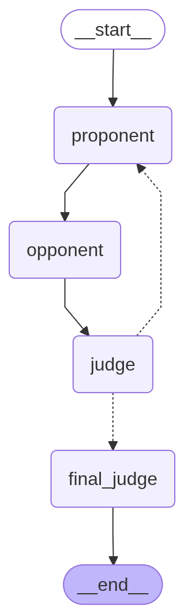

# AI Debate Arena

[](https://opensource.org/licenses/MIT)
[](https://www.python.org/)


A system for running automated debates between AI agents with a judge to evaluate the arguments. This project features two implementations: one using standard LangChain and another using LangGraph for workflow orchestration.

## Features

- Two AI agents (Proponent and Opponent) debate any given topic.
- A Judge agent evaluates the arguments periodically and provides a final verdict.
- Configurable parameters for creativity (temperature) and maximum rounds.
- Token usage tracking for each agent and the entire debate.
- Dynamic debate length based on judge evaluation.
- Real-time updates in the Web UI version.

## Architecture

The system supports two execution engines:
1. **LangChain version**: Uses a traditional imperative loop to manage the debate flow.
2. **LangGraph version**: Uses a stateful graph to orchestrate the agents, allowing for more complex state management and clearer separation of concerns.



## Installation

1. Ensure you have [Ollama](https://ollama.ai/) installed.
2. Pull the default model:
   ```bash
   ollama pull gemma4:e2b
   ```
3. Install Python dependencies:
   ```bash
   pip install -r requirements.txt
   ```

## Usage

### Command Line Version

You can run the debate directly from the terminal using either implementation:

**LangChain version:**
```bash
python debate_agents_lc.py
```

**LangGraph version:**
```bash
python debate_agents_langgraph.py
```

*Note: Topics and debate parameters are configured directly in the code at the bottom of these scripts.*

### Web UI Version

The Streamlit UI provides a more interactive experience with live updates.

**To run the LangChain UI:**
```bash
python run_ui_langchain.py
```

**To run the LangGraph UI:**
```bash
python run_ui_langgraph.py
```

The UI allows you to:
- Enter custom debate topics.
- Adjust debate parameters (number of rounds, creativity levels).
- Configure the Ollama model and API token (for remote endpoints).
- View the debate conversation in a chat-like interface.
- See the judge's final verdict and token statistics.
- Watch the debate unfold in real-time.

## Configuration

Key parameters that can be adjusted in the UI or code:
- `max_rounds`: Maximum number of debate rounds (default: 3).
- `pro_temp`: Proponent creativity level (0.0-1.0, default: 0.9).
- `con_temp`: Opponent creativity level (0.0-1.0, default: 0.7).
- `judge_temp`: Judge strictness (0.0-1.0, default: 0.3).
- `model_name`: The Ollama model to use (default: `gemma4:e2b`).

## Requirements

- Python 3.9+
- Ollama with the `gemma4:e2b` model (or any other compatible model)
- Langchain-core
- LangGraph
- Streamlit (for UI version)
